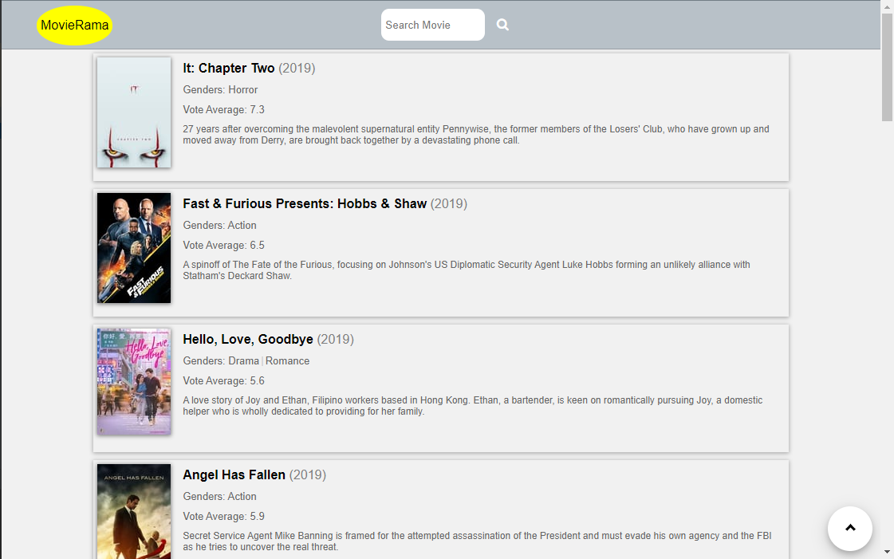
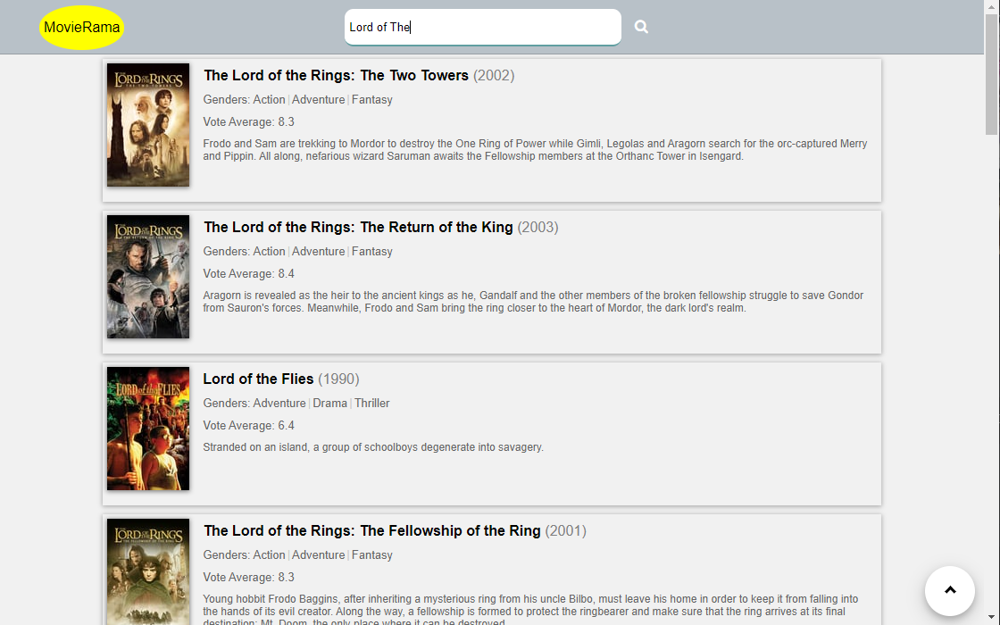
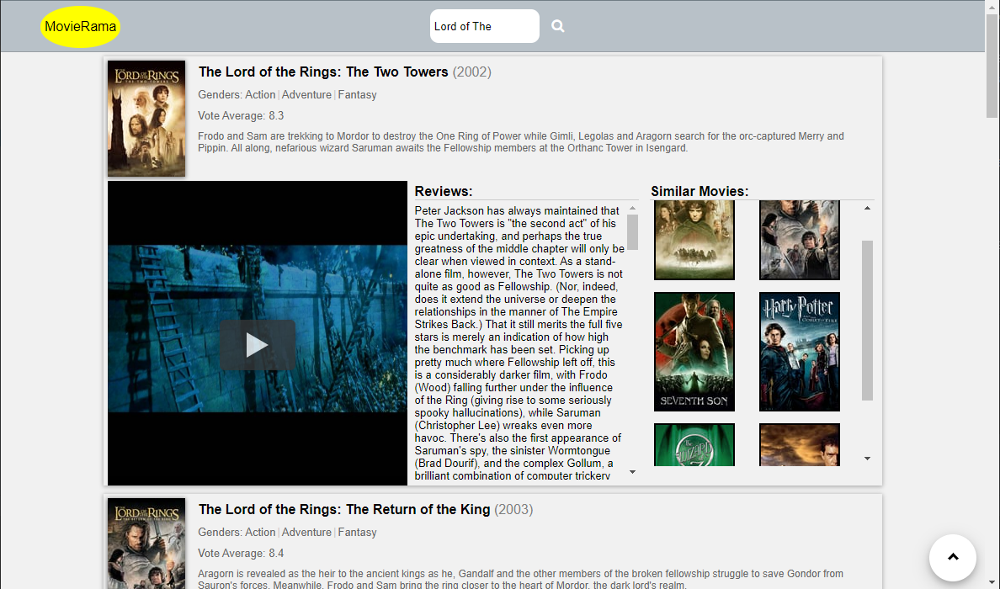
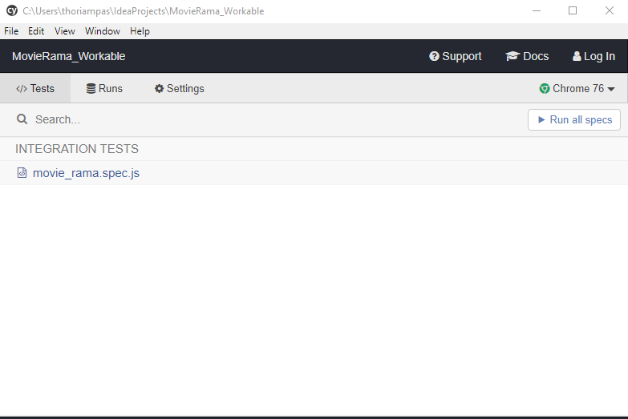

## MovieRama

MovieRama is an application for viewing the movies that are playing now into the theaters as well as searching 
for a specific movie and viewing its details.

## Table of contents

> * [MovieRama](#MovieRama)
>   * [Requirements](#Requirements)
>   * [Installation](#installation)
>   * [Usage](#usage)
>     * [Screenshots](#screenshots)
>   * [Testing](#Testing)
>     * [Cypress](#Cypress)
>     * [Jest](#Jest)
>   * [Build](#build)
>    

## Requirements
To run this application locally, you must have installed into you machine [node.js](https://nodejs.org/en/).

## Installation
To start this application locally, just run `npm start` into the terminal.
Make sure that dependencies has been installed with `npm install` before trying to start the application.

## Usage
When the page first loads, the user will see a list of the movies that are now playing into the theaters. 
The User can search for any movie with the input field on the app bar. 
In both cases, as the user scroll to the bottom of the page, the MovieRama will fetch the next page of movies.
If the User click on any of the movies, the card will expand and details about the trailer, reviews and relative movies
will appear. 

### Screenshots
When the page load first time:

When the user search about a movie:

When the user expand the details of a movie:

## Testing

The application uses [cypress](https://www.cypress.io/) for end-to-end test and [jest](https://jestjs.io/) for unit test.

###Cypress
To run the end-to-end tests, run into the console `npm run cypress` and on the cypress panel select the `movie_rama.spec.js`
and it will run the test automatically. 
> *The application must be running for the tests to begin.*

###Jest
To run the unit tests, run into console `npm run test`.

## Build

To build this application, run `npm run build` into the console and when the build ends, a dist folder will appear with
static files which contains an index.html file and a main.bundle.js file.

